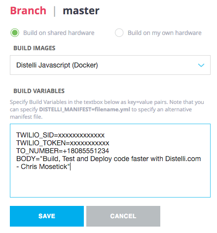

sms
===

_Use [Distelli](https://www.distelli.com) + Twilio to send an SMS text message via Node_

## Usage with Distelli.com

- Fork this repo to your own Github account
- Open your Distelli account and browse to Applications
- Create a new Application and select Github as the source (accept the OAuth perms)
- Choose your fork of this repo as the basis of your application

- Edit `twilio.js`, specifically the `from:` phone number. (This is your outgoing number that twilio assigned to you)
- Edit the `body` of your message. This can be hardcoded in twilio.js, but it's even better if set
as a [Distelli Environment variable](https://www.distelli.com/docs/reference/environment-variables#user-supplied-manifest-environment-variables).

Set these Environment Variables within the build options of your application:
```
TWILIO_SID=xxxxxxxxxxxxx
TWILIO_TOKEN=xxxxxxxxxxx
TO_NUMBER=+18085551234
BODY="Build, Test and Deploy code faster with Distelli.com - Chris Mosetick"
```




- Review `distelli-manifest.yml`  
This is an optional feature in Distelli, and if you check the "use manifest file" box in your application,
this will be referenced for your build procedure.

## Pre-reqs

- You'll need a free [Twilio trial](https://www.twilio.com/try-twilio) account to send SMS txt messages from this app. (takes about three minutes to sign-up and verify)
- Add a new twilio phone number to your account, make sure it's configured for SMS.  
- Verify your mobile number with twilio.  
_note that twilio trial accounts are restricted, so you'll only be able to send messages to your own mobile number._

## Next steps

Use [Distelli](https://www.distelli.com) to build and deploy your own SMS applications!
